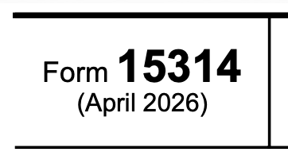
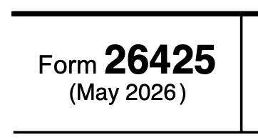

# pdf_text_replace

Replace text strings in a PDF while preserving the original font, size, and color.

## Example

Imagine a PDF exists in the world named `f15314.pdf`

It has text with "Form 15314" and "April 2026" in it like so:



You want to change `April 2026` to `May 2026` and that form number `15314` to `26425`, and run:

```
wget https://www.irs.gov/pub/irs-pdf/f15314.pdf
pdf_text_replace.py --input f15314.pdf --replace "April 2026 => May 2026" --replace "15314 => 26425"
 'April 2026' => 'May 2026'
 '15314' => '26425'
  Page 1: 'April 2026' => 'May 2026' (1x)
  Page 1: '15314' => '26425' (2x)
Created: f15314_replaced.pdf
```

You'll get:



This style of invocation uses two `--replace` arguments.

You could also put all of the replacements you wanted to make in a file and direct the script to use that file with `--replacements`:

```
# Comments Allowed
A => ONE
B => TWO
C => THREE
D => FOUR
```

## Additional Usage Details

```
pdf_text_replace.py --input <file.pdf> --replace "OLD => NEW" [--replace "..."] [--output <output.pdf>]
pdf_text_replace.py --input <file.pdf> --replacements-file <replacements.txt> [--output <output.pdf>]
```

* At least one of `--replace` or `--replacements-file` is required. Both can be combined.
* If `--output` is not specified, the word `_replaced` is appended to the input file

| Flag | Description |
|---|---|
| `--input` | Input PDF file (required) |
| `--replace` | A single replacement string `OLD => NEW` (repeatable) |
| `--replacements-file` | File of replacements (see format below) |
| `--output` | Output PDF path (default: `<input>_replaced.pdf`) |

This project also comes with an [mcp_server](mcp_server.py).

The mcp aspect is managed with `make mcp-install` and `make mcp-remove`

## Development

See [VENV.md](VENV.md) for virtual environment setup (including optional direnv integration) and [DEVELOPMENT.md](DEVELOPMENT.md) for running tests and installing/removing the MCP server.
